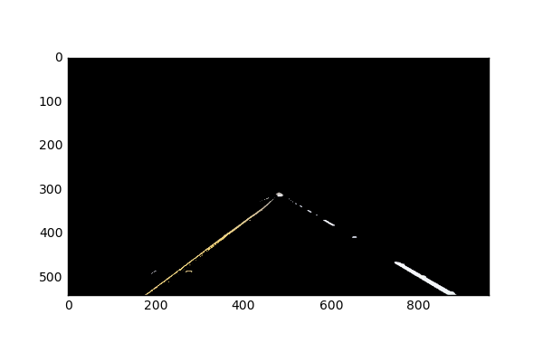
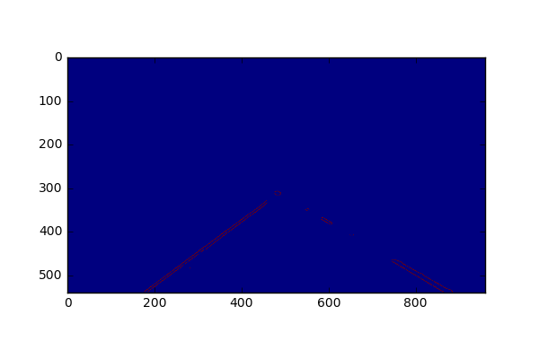
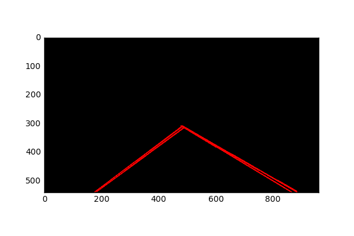

# **Finding Lane Lines on the Road** 

**Finding Lane Lines on the Road**

The goals / steps of this project are the following:
* Make a pipeline that finds lane lines on the road
* Reflect on your work in a written report

---

## Reflection

### 1. Description

My pipeline has five stages. Each stage, except the last one has parameters to tune the result, these parameters are shown below too. The input of the pipeline is an image of the front camera, the output is the same image with a layer on the top of it, this layer consists the borders of our lane.

#### Stage1 - color filter 
Applies a color filter that omits unrelevant darker things.

##### Parameters:

Lower bound of color filter

Upper bound of color filter

#### Stage2 - cut image
A quadrilateral was defined to cut our lane from the image. 

##### Parameters:

Distortion of the upper side along x toward the apex (distort_x)

Offset of the upper side of the polygon from the top along y (distort_y)

#### Stage3 - Canny Transform
Stage3 transforms the image to grayscale, then applies Gaussian Blur to it, then applies Canny Transform to it. Last
one seems a but useless on all of the test pictures but in WhiteCarLaneSwitch, there is a small yellow bump on the
lower-left part partially erased by this transform.

##### Parameters:
Kernel size

Low threshold of Canny transformation

High threshold of Canny transformation

#### Stage4 - Hough Transform and extrapolate
Stage4 applies Hough Transform on the image. Then the goal is to get two lines on each side averaged from the output of Hough transform.
Original draw_lines was renamed to draw_raw_lines, i could use it later too. 

##### Extrapolating and averaging
In _draw_lines_, numpy polyfit was used to get an average
line of left and right lanes: all points of the lines are collected and then polyfit was applied on them. There are two bound parameters used to sort out buggy lines from the result. These
parameters represent minimum and maximum slopes of accepted lines to be averaged. 
The slope and the shift of the line is used to the extrapolation. A ratio paramter used to cut the top of the lines off on a constant height.

##### Parameters:

Ratio defines the top of the result lines

The minimum slope of line (inverted on the right line)

The maximum slope of line (inverted on the right line)

#### Stage5 - Add lines to original image
Finally the original image and the extrapolated lines are composed together.

### 2. Shortcomings
Pipeline wouldn't work when light conditions changes (wet road, night road, etc..)

Pipeline wouldn't work if shadows cover the lanes.

Lines are linear. Steep curves aren't followed.

Parameters depending on camera position are hardcoded, tuned to work well just on highways,  with this example video. so pipeline would not work on
roads with steep curves and slopes, with other camera positions and angles.

### 3. Suggest possible improvements to your pipeline

Detect the horizont, and align "cut polygon" to it

Detect shadowed areas and light them up to the level of areas not covered by shadow
